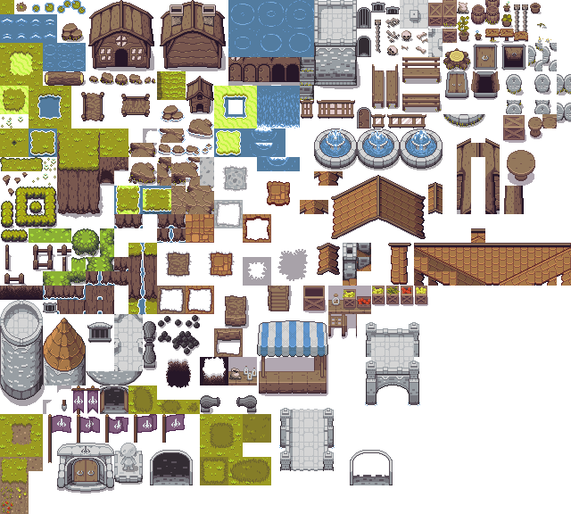
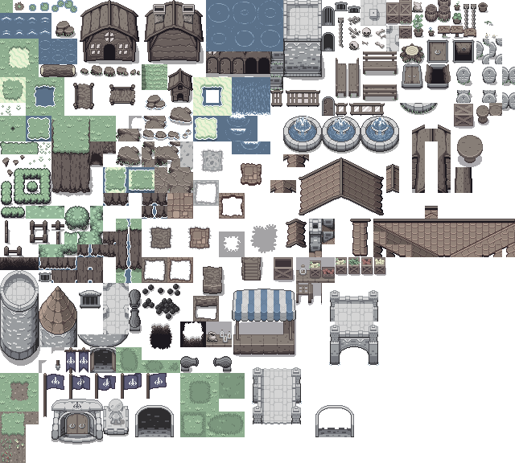
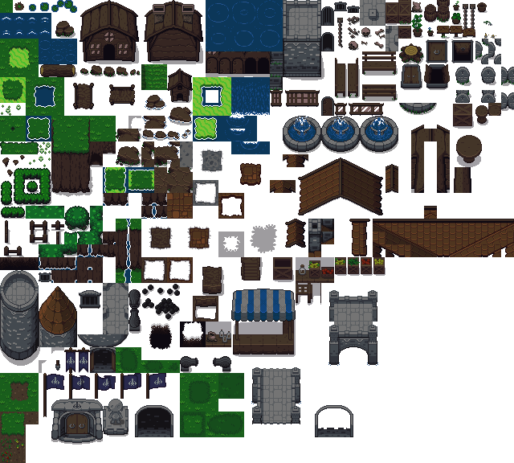
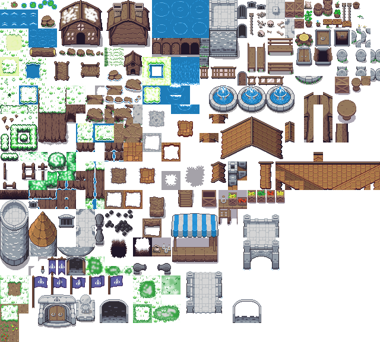
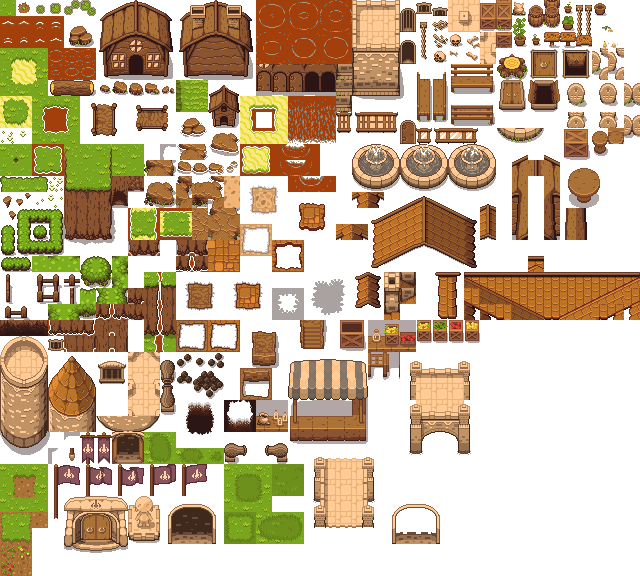

# Adaptability of the Zelda-like Tileset

## different options

- only outdoor tiles need to be changed
- change color tone of tilemap in unity
  - small changes to the color tone possible to still look good
- change colors of tileset in gimp
  - color temperature/saturation etc
  - switch color from green to white for example
    - will be time consuming to make it look good
  - change sprites individually for better results  
- change tileset in photoshop
  - same feautures as in gimp
  - replace colors feature with preview
- comes down to what you used more gimp/photoshop
  - im more familiar with PS so i knew where certain features are, and found it more clear
- could be time consuming but only needs to be done once for snow/sand
- each snow/sand region needs a new tilemap in unity for better organization
  - process should be straightforward once the tileset is done

## best option

- change the tileset to other looks so we have different tilesets
- with gimp or photoshop
- create a demo tileset to check if it looks good

## result

- created some tilesets with changed colors overall
  - steppe  
  
  - cold  
  
  - night  
  
- created demo tileset for more complex adaptation with brush tools
  - snow  
  

## problems

- transitions from different tiles not smooth in snow tileset
  - needs work to fix and make look better

## feedback

- positive feedback from uwe

## next step

- try to create lava tileset
  - problem: lava not just red water
  - hard to get colors right  

- maybe use a premade lava tileset?
  - would look better
  - does it fit our theme?
